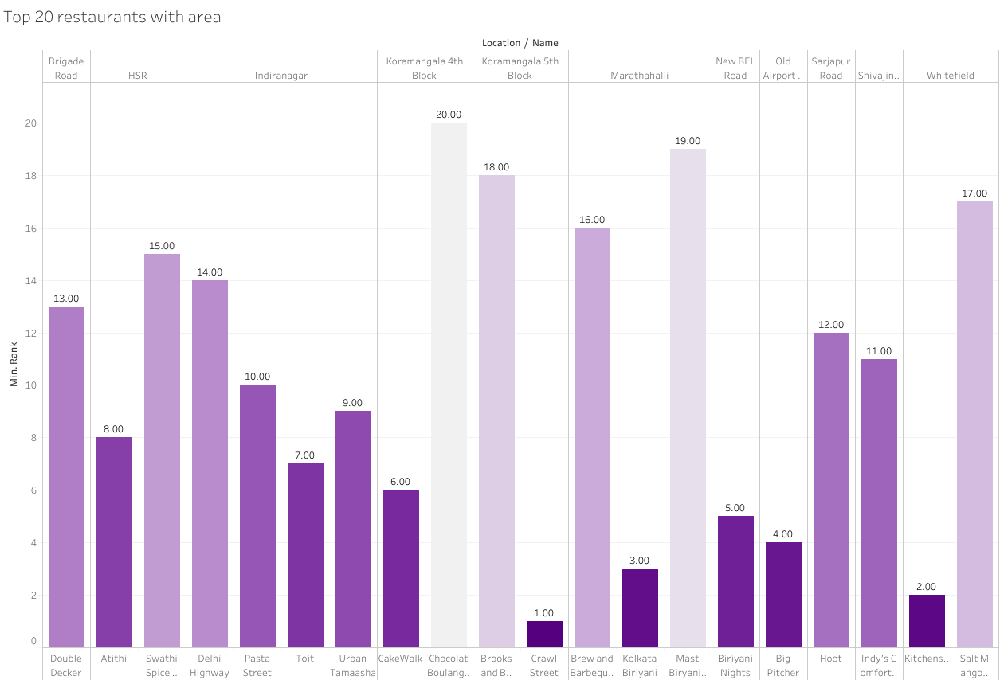

# LHL_FINAL_PROJECT
## Location-specific Dish Discovery( A Culinary Adventure in Bangalore)

### Introduction
Location-specific Dish Discovery is a user-friendly platform designed to help people discover the best restaurants in Bangalore based on their location and the specific dish they desire. It serves as a one-stop solution for locals and tourists, providing personalized recommendations and detailed information about each restaurant.


Bangalore, known as the "Silicon Valley of India," is the perfect city to launch such an API. With its vibrant food culture, diverse population, and numerous eateries, Bangalore attracts millions of visitors each year. This makes it an ideal testing ground for Location-specific Dish Discovery.


Here, we can see the geographical locations of different restaurants in the city of Bangalore. Hence, the primary goal of this API is to make it effortless for users to explore Bangalore's culinary landscape. With just a few clicks, users can input their location and desired dish, whether it's aromatic biryani, crispy dosas, or delectable street food. The API utilizes advanced algorithms and real-time data to provide a curated list of the best restaurants in the specified area, ensuring a delightful gastronomic experience for all.

### Project Structure and Content

#### Data Cleaning
1. The original dataset consists of 17 columns and 51,717 rows, with each row having a unique URL.
2. Duplicate entries based on address and name were identified and dropped from the dataset.
3. Null values were replaced with appropriate values, and columns with a significant number of null values were dropped.
4. Unnecessary columns such as URL and phone were removed from the dataset.
5. Data types and formats of columns were adjusted as desired, such as the rate column.
6. The cleaned dataset was saved as a CSV file.
#### EDA
1. Visual representation was used to analyze the number of different restaurants in Bangalore.


2. The top 50 popular restaurants in Bangalore were determined based on their ratings.


3. The total number of restaurants available in each neighborhood was calculated.


4. Latitude and longitude coordinates were extracted from the location column using the geopy.geocoders library.

5. A correlation matrix was created to better understand the relationships between useful features.


6. Learn about top 20 ranked restaurants and it's location.


7. The top 50 lacations in Bangalore were determined based on their average ratings.


#### Feature Selection
1. The reviews_list and menu_item columns, initially read as strings, were converted to lists using the ast.literal_eval function.
```import ast
import re
import math
df['reviews_list'] = df['reviews_list'].apply(ast.literal_eval)
df['menu_item'] = df['menu_item'].apply(ast.literal_eval)
```
2. Liked food items were extracted from the reviews_list by comparing words with the menu list.
```ind = df[df['reviews_list']!="[]"].index
for i in ind:
    
    liked = set()
    for review in df.loc[i,'reviews_list']:
        if(review[0]!=None and float(review[0].replace('Rated ',''))>=3):
            for menu in new_menu_corpus:
                if(menu in review[1]):
                    liked.add(menu)
    df.loc[i,'liked_food_from_review'] = str(list(liked))
```
3. A new column, review_clean, was created by removing punctuation, tokenizing, removing stop words, and lemmatizing using WordNetLemmatizer.
4. Positive words were extracted using Google's pre-trained Word2Vec model.
```
positive_seeds = ['good', 'great', 'excellent', 'wonderful', 'awesome']
positive_words = []

for seed_word in positive_seeds:
    similar_words = model.most_similar(positive=[seed_word], topn=500)
    positive_words.extend([word for word, similarity in similar_words])
```
5. The count_positive_words(review) function was defined to count the number of positive words in reviews, and a new column, positive_words, was created using this function.
```
from nltk.corpus import wordnet

def count_positive_words(review):
    count = 0
    tokens = tokenize(review)
    for token in tokens:
        synsets = wordnet.synsets(token)
        for synset in synsets:
            if synset.pos() == 'a' and synset.lemmas()[0].name() in positive_words:
                count += 1
    return count
```
6. The "rank" column was created using a ranking algorithm that considers rating, reviews, votes, and approximate cost. The algorithm assigns a weighted score to each restaurant and ranks them accordingly.
```
df['rank'] = (
    df['rate'] * df['votes'] +
    df['positive_words'] * 100 +
    df['approx_cost(for two people)'] * -1
)

# Rank the restaurants based on the 'rank' column
df['rank'] = df['rank'].rank(ascending=False)

# Sort the DataFrame by rank in ascending order
df = df.sort_values('rank')
```
7. The featured dataframe was saved as a CSV file.

#### API 
1. The Flask API consists of a single endpoint, /api/top_restaurants, which accepts GET requests. It retrieves the top restaurants based on a specific dish name and location within a certain distance.
2. The get_coordinates(location) function uses the Nominatim geocoding service from the geopy library to obtain the latitude and longitude coordinates of a given location.
3. The get_top_restaurants_api() function is the main API endpoint. It retrieves the dish_name and location parameters from the request's query string.
     - It checks if both parameters are provided. If not, it returns an error response.
     - It appends the city and country to the provided location and passes it to get_coordinates() to obtain the coordinates.
      -It reads a CSV file named "API.csv" into a Pandas DataFrame.
     - The DataFrame is filtered based on the dish_name.
     - Rows with missing coordinates are dropped.
     - Distances between each restaurant's coordinates and the specified location are calculated using the geodesic() function.
     - The DataFrame is sorted based on rank and filtered to include only the top 3 restaurants within a 5 km radius.
     - The restaurant names and addresses are extracted from the DataFrame.
     - Finally, the names and addresses of the top restaurants are returned as a JSON response.
4. The if __name__ == '__main__': block starts the Flask application on host 0.0.0.0 and port 8080 when the script is run directly.

#### Deploy on AWS
The API has been deployed on an AWS instance and is accessible at the following link: [Location-specific Dish Discovery API](http://18.191.195.203:8080/api/top_restaurants?)

Here's an example of how to send a request and receive a response:
```
import requests

dish_name = 'roast chicken'
location = 'Bannerghatta Road'

# Make the API request
url = 'http://18.191.195.203:8080/api/top_restaurants?'
params = {'dish_name': dish_name, 'location': location}
response = requests.get(url, params=params)

# Check if the request was successful
if response.status_code == 200:
    try:
        data = response.json()
        top_restaurants = data['top_restaurants']
        print(f"Top restaurants for {dish_name} in {location}: {top_restaurants}")
    except ValueError:
        print("Error: Invalid JSON response.")
else:
    print(f"Error: {response.status_code} - {response.text}")
```
Output: ```Top restaurants for roast chicken in Bannerghatta Road: [{'address': '77/A, 4th Floor Floor, Jyoti Nivas College Road, Koramangala 5th Block, Bangalore', 'name': 'Crawl Street'}, {'address': '448, 4th Floor, Big Bazaar Building, SRK Towers, Bannerghatta Road, Bangalore', 'name': 'The Yellow Submarine'}, {'address': '118, Koramangala Industrial Area, Koramangala 7th Block, Bangalore', 'name': 'Koramangala Social'}]```

You can also use Postman to send requests to the API.


Feel free to explore the Location-specific Dish Discovery API and discover the top restaurants in Bangalore based on your desired dish and location!


